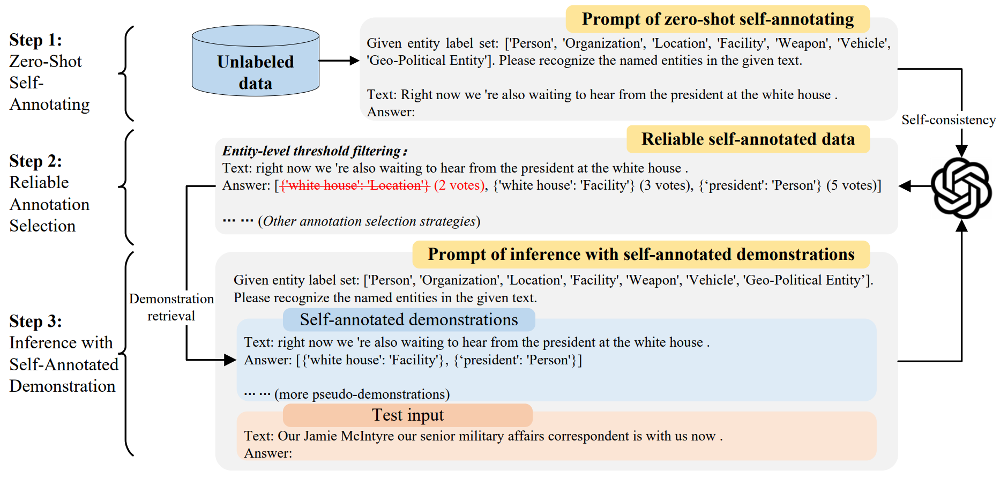

# Self-Improving for Zero-Shot Named Entity Recognition with Large Language Models

This is the github repository for the paper to be appeared at NAACL 2024 main conference: [Self-Improving for Zero-Shot Named Entity Recognition with Large Language Models](https://arxiv.org/abs/2311.08921).

## Introduction

A self-improving framework for zero-shot named entity recognition (NER) with large language models (LLMs), which utilizes unlabeled data to stimulate the self-learning ability of LLMs via a training-free process.



This work pushes the performance boundary of zero-shot NER with LLMs by proposing a training-free self-improving framework, which utilizes an unlabeled corpus to stimulate the self-learning ability of LLMs. The pipeline of the proposed framework is:

* First, we use the LLM to make predictions on the unlabeled corpus using self-consistency (SC) and obtain a self-annotated dataset.
* Second, we explore various strategies to select reliable annotations to form a reliable self-annotated dataset.
* Finally, for each test input, we retrieve demonstrations from the reliable self-annotated dataset and perform inference via in-context learning.

Please find more details of this work in our [paper](https://arxiv.org/abs/2311.08921).

## Directory

* `code`: All python code
  * `standard`: Regular zero-shot code.
  * `self_consistent_annotation`: Self-improving code.
* `data`: Data file, including self-annotated demonstrations generated by the LLM itself.
* `prompts`: Prompts file, generated during running, used to prompt the LLM to perform NER.
* `results`: Results file, generated during running, including model output and result metrics.
* `scripts`: Bash script to run the code.

## Usage

### Requirements

We run our code on Windows. The following are the dependencies:
python 3.8, openai 0.27.4, pytorch 2.0.1, pandas, hanlp

### Datasets

We provide processed WikiGold dataset in this repository for quick start, along with its generated prompts, self-annotation results and inference results.

In data folder of [wikigold](data/wikigold):

* `*GPTEmb.npy`: Sample embeddings obtained from text-embedding-ada-002.
* `train_shuffle_42*`: Files related to training set shuffled with seed 42.
* `self_consistent_annotate`: Directory for the generated self-annotated demonstrations. Here are the meaning. Below are the meanings of different string tags in the file name of the provided demonstration files.
  * `std`: The default standard prompt method used in this paper. Custom prompt methods can be added by modifying *DesignPrompts.py* in [standard](Self-Improve-ZSNER/code/standard) and [self_consistent_annotation](Self-Improve-ZSNER/code/self_consistent_annotation).
  * `c5`: Self-consistency with sampling quantity set to 5.
  * `all_th_spl_4.0_296`: Keep all entities without filtering, then do sample-level threshold filtering with threshold set to 4.0, and the number of filnal retained samples is 296.
  * `th_ent_4.0_500`: Entity-level threshold filtering with threshold set to 4.0, no sample-level filtering, and the number of retained samples is 500.

We also provide other processed datasets used in our paper at the [Google Drive](https://drive.google.com/file/d/13ODu2-PQWshJTVf-LFt8zdVrzTF9MAfE/view?usp=sharing), except [ACE05](https://catalog.ldc.upenn.edu/LDC2006T06) and [Ontonotes 4](https://catalog.ldc.upenn.edu/LDC2011T03) for copyright reasons. You can download and unzip the dataset files and put them in the [data](data) folder.

### Generate embeddings

Run the below command to generate embeddings with OpenAI API.

```bash
python code/standard/GenerateEmbsGPT.py --dataname wikigold --datamode test --emb_model text-embedding-ada-002 --emb_encoding cl100k_base
```

### Run

We provide shell scripts in folder [scripts](scripts) for quick start.The generated prompts will be saved to folder [prompts](prompts). The response from the LLM and the evaluation results will be saved to folder [result](result).

Run the following commands in the provided order to use our methods.
Before you run on ChatGPT, please set your OpenAI API Keys in `my_openai_api_keys` in [const.py](code/const.py).

```shell
# --- No-demos ---
sh scripts/wikigold_no_demos.sh

# --- Self-improving ---
# Self-annotating and two-stage majority voting
sh scripts/wikigold_1_self_annotate_TSMV.sh
# Entity-level threshold filtering
sh scripts/wikigold_2_entity_level_sel.sh
# Sample-level threshold filtering
sh scripts/wikigold_2_sample_level_sel.sh
# Inference with Diverse nearest with SC ranking
sh scripts/wikigold_3_test_inference.sh
```

### Arguments

**Self-consistency (SC)**

* `--consistency`. `0` means no SC, `1` means using SC with two-stage majority voting.
* `--temperature`. `0` for not using SC; default set to `0.7` for SC.
* `--query_times`. Number of sampled responses in SC. We defaultly set to `5` in our main experiments.

**Reliable annotation selection**

* `--entity_level_selection`. `all` means all entities. `th_ent` means entity-level SC threshold filtering.
* `--sample_level_selection`. `th_spl` means sample-level SC threshold filtering.

**Inference**

* `--demo_retrieval_method`. `"GPTEmbDvrsKNN"` means diverse nearest.
* `--diverseKNN_number`: the value of K in the diverse nearest.
* `--diverseKNN_sampling`: `random` means random sample from K neighbors. `Sc` means select top-k SC score samples from K neighbors.

## Citation

```bibtex
@misc{xie2023selfimproving,
      title={Self-Improving for Zero-Shot Named Entity Recognition with Large Language Models}, 
      author={Tingyu Xie and Qi Li and Yan Zhang and Zuozhu Liu and Hongwei Wang},
      year={2023},
      eprint={2311.08921},
      archivePrefix={arXiv},
      primaryClass={cs.CL}
}
```
